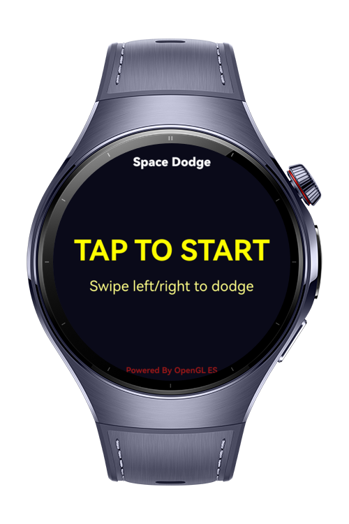
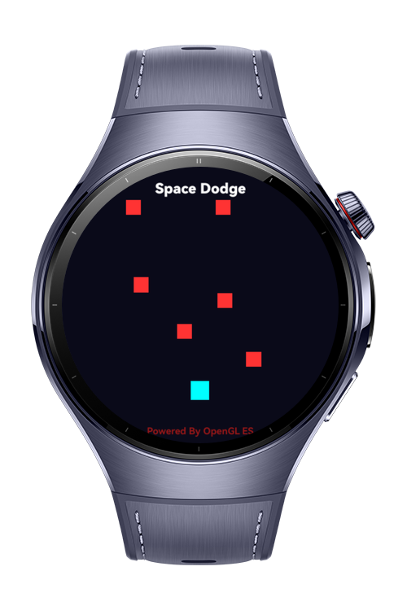
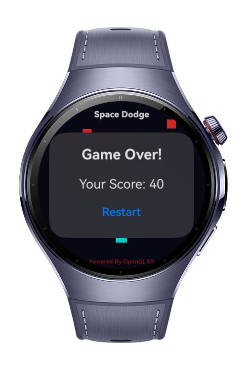

> **Note:** To access all shared projects, get information about environment setup, and view other guides, please visit [Explore-In-HMOS-Wearable Index](https://github.com/Explore-In-HMOS-Wearable/hmos-index).

# Space Game (NDK & OpenGL)

A simple arcade-style space game built with OpenGL ES on HarmonyOS. Players control a cyan spaceship to avoid falling red obstacles while scoring points. Player ship (cyan) moves horizontally at fixed speed. Red obstacles fall from random positions.

* **Native OpenGL Rendering**: High-performance graphics using OpenGL ES 3.0
* **VSync Synchronization**: Smooth 60 FPS gameplay
* **Touch Event Integration**: Native touch handling for responsive controls
* **Callback System**: Real-time score updates and game state synchronization between native and ArkTS layers

# Preview

<div>
  
  
  
  
</div>

# Use Cases

* **Progressive Difficulty**: Dynamic obstacle speed adjustment
* **Objective**: Avoid falling obstacles for as long as possible to maximize your score.
* **Controls**: Left and Right swipe input can move player
* **Scoring**: +10 points for each obstacle successfully avoided
* **Obstacles**: spawn every ~0.5 seconds and speed increases progressively with score
* **Game Over**: Occurs when the player's spaceship collides with any obstacle
* **Game States** Start, Playing, Game Over

# Tech Stack

* **Languages**: ArkTS, C++
* **Frameworks**: HarmonyOS SDK 5.1.0(18), OpenGL ES 3.0
* **Tools**: DevEco Studio Ver 5.1.0.842
* **Libraries**:
    - @kit.ArkUI (XComponent)
    - Native OpenGL ES 3.0
    - EGL (OpenGL rendering context)
    - Native VSync API
    - NAPI (Native API bridging)

The game uses a hybrid architecture:

1. **ArkTS Layer** (UI): Handles game state display, buttons, and overlays
2. **NAPI Bridge**: Connects ArkTS to native C++ code
3. **Native C++ Layer**:
    - Game logic (collision detection, scoring, obstacle spawning)
    - OpenGL ES rendering (player ship, obstacles)
    - VSync-synchronized game loop (60 FPS)
    - Callback system for UI updates

## Directory Structure

```
|---entry/src/main
| |---cpp
| | |---manager
| | | |---plugin_manager.cpp       # XComponent plugin manager
| | | |---plugin_manager.h
| | |---render
| | | |---egl_core_shader.cpp      # OpenGL ES rendering and game logic
| | | |---egl_core_shader.h
| | | |---plugin_render.cpp        # Native rendering bridge
| | | |---plugin_render.h
| | |---common
| | | |---plugin_common.h          # Logging utilities
| | | |---native_common.h          # NAPI macros
| | |---types/libentry
| | | |---index.d.ts               # TypeScript type definitions
| | |---napi_init.cpp              # NAPI module initialization
| |---ets
| | |---entryability
| | | |---EntryAbility.ets
| | |---pages
| | | |---Index.ets                # Main game UI
| | |---constants
| | | |---CommonConstants.ets
```

## Constraints and Restrictions

**Supported Devices**
* HarmonyOS devices with OpenGL ES 3.0 support
* Tested on: Huawei Watch 5

**Requirements**
* HarmonyOS SDK 5.1.0 or higher
* OpenGL ES 3.0 support
* Native development capabilities enabled

# License

Space Game is distributed under the terms of the MIT License. See the LICENSE file for more information.
